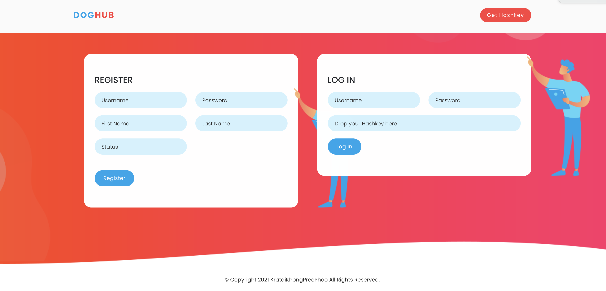

# DogHUB Decentralies e-Learning System :tada:

DogHUB was implemented via a decentralised system to let the teacher or student see the assignment in the classroom. The user can upload any file to the system by uploading a file and get the hash key from the uploading process.

### Installation required :tada
1. IPFS Desktop https://github.com/ipfs/ipfs-desktop/releases
2. MAMP or XAMP (I'm using MAMP) for localhost
3. Project's folder in htdocs (/Applications/MAMP/htdocs)

### Commands

run IPFS
```bash
ipfs daemon 
```
Go to dogHub directory and running node using app.js
```bash
node app.js
```
### Setup
1. open terminal or cmd
2. run 
```bash
ipfs daemon 
```
3. open editor (I'm using VS code)
4. to dogHub directory
```bash
cd dogHub 
```
5. run node
```bash
node app.js 
```
6. open MAMP for localhost

### How to use DogHub

1. Open localost 
2. Enter first.php to see the registration page



3. Account registration
4. Click Get Hashkey (Navigation bar will navigate to its topic)


5. Upload and get hashkey or download with hashkey


6. Login on registration page with hashkey
7. Upload hashkey 


8. See the assignment


